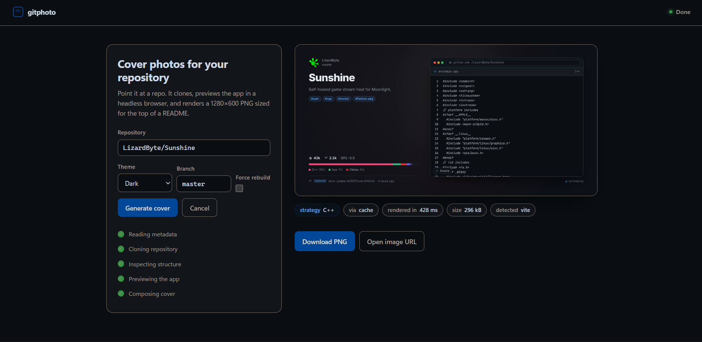

# gitphoto

Self-hosted service that renders a **1280&times;640 cover photo** for a GitHub repository, sized to sit at the
top of a README.

It reads repository metadata from the GitHub API, shallow-clones the repo, then decides how to show the project —
capturing the running app in a headless browser where possible — and composes the result into a single PNG.



---

## What it produces

A single 1280&times;640 PNG containing:

| Zone | Contents |
|------|----------|
| Left column | Owner avatar, owner name, repository name, description, topic chips, star / fork / license counts, language bar with percentages, latest commit |
| Right column | The project preview inside a browser frame: a screenshot of the live app, the README's own screenshot, or a highlighted source snippet |
| Backdrop | Coloured glow derived from the repository's language palette and its name, so every repo gets a distinct but deterministic cover |

Two themes ship: `dark` and `light`.

The generated README snippet is a centred, full-width ``.

---

## Preview strategies

The preview is the part of a cover that actually says something, so strategies are tried in descending order of
confidence and the first one that produces a usable image wins:

| # | Strategy | When it is chosen | Cost |
|---|----------|-------------------|------|
| 1 | **README screenshot** | The README embeds a real screenshot. Badges, logos, wordmarks and anything under 300&times;100 are rejected | ~200 ms |
| 2 | **Static page** | The clone contains a prebuilt `index.html` (root, `public/`, `dist/`, `build/`, `out/`, `www/`, `site/`, `docs/`). Served from disk and screenshotted live | ~2 s |
| 3 | **Dev server** | `package.json` exposes `dev` or `start` for a known framework. Requires `ALLOW_INSTALLS=true` | 1–3 min |
| 4 | **Source snippet** | A library with no UI to show. Renders the entry file with syntax highlighting | instant |
| 5 | **Empty** | Nothing renderable. The cover still shows the metadata | instant |

Strategies 1 and 2 are the common cases and neither one needs a build.

Ranking the README candidates is where most of the care went: badge services are rejected by host, then the probe
reads only the leading 256 kB of each candidate to check its real dimensions, so a 4 MB screenshot is never
downloaded just to be rejected.

---

## Running it

### Docker (recommended)

```bash
git clone <this repo> gitphoto && cd gitphoto
cp .env.example .env
# optional but recommended: add GITHUB_TOKEN to .env
docker compose up -d --build
```

The service listens on `9780`. `/data` is a named volume holding clones, covers and the cache.

### Local

```bash
npm install
npm run fonts     # vendors Inter + JetBrains Mono, run once
npm start
```

`npm install` triggers `playwright install --with-deps chromium`.

### Configuration

| Variable | Default | Notes |
|----------|---------|-------|
| `PORT` | `9780` | |
| `GITHUB_TOKEN` | *(empty)* | Lifts the API limit from 60/hr to 5000/hr. Read-only access to public repos is enough |
| `DATA_DIR` | `./data` | Clones, covers, cache. Point this at fast local storage — a shallow clone over SMB is an order of magnitude slower |
| `RENDER_TIMEOUT_MS` | `90000` | Hard ceiling per render |
| `CACHE_TTL_MS` | `21600000` | Six hours |
| `RENDER_CONCURRENCY` | `2` | Each render holds a browser page and possibly a preview process |
| `ALLOW_INSTALLS` | `false` | Enables `npm ci` + dev servers |

### About `ALLOW_INSTALLS`

Strategy 3 runs third-party `npm install` lifecycle scripts and starts the repo's dev server. It is off by
default for that reason. Turn it on only for repositories you trust, and prefer a private instance for it.

---

## API

### `GET /api/cover.png`

The only endpoint a README needs.

| Query | Default | Notes |
|-------|---------|-------|
| `repo` | *(required)* | `owner/repo`, a GitHub URL, an ssh remote, or an API URL |
| `theme` | `dark` | `dark` or `light` |
| `branch` | default branch | |
| `refresh` | `0` | `1` bypasses the cache |
| `download` | `0` | `1` sets `Content-Disposition: attachment` |

```html
<p align="center">
  
</p>
```

Response headers carry `X-Gitphoto-Strategy` (`image` / `site` / `code` / `none`) and `X-Gitphoto-Cached`.

### `GET /api/stream`

Server-sent progress, then the same payload as JSON. The web UI is a client of this.

```
event: progress
data: {"stage":"preview","detail":"Fetching README screenshot"}

event: result
data: {"fileName":"6dc6f7b3….png","strategy":"image","markdown":"<p align=\"center\">…"}
```

Stages: `meta` → `clone` → `detect` → `preview` → `compose` → `done`.

### `POST /api/cover`

```json
{ "repo": "owner/repo", "theme": "dark", "branch": "main", "refresh": false }
```

### `GET /api/health`

Reports the active themes, whether the bundled fonts loaded, whether installs are enabled, and live render queue
depth.

### `GET /:owner/:repo` and `GET /:owner/:repo/tree/:branch`

A GitHub URL with the host swapped is a shortcut into the web UI. Swapping
`github.com` for the gitphoto host — `https://github.com/brgjr10/pit-tv` →
`https://gitphoto.com/brgjr10/pit-tv` — fills the form and starts rendering.
The optional `/tree/branch` segment mirrors GitHub's own branch URLs.

```
https://gitphoto.com/brgjr10/pit-tv
https://gitphoto.com/brgjr10/pit-tv/tree/main
```

Both segments are validated with the same rules as a repository reference, so a
`..` or any other path-traversal attempt answers 404 rather than reaching the
SPA.

---

## Caching

The cache key is `sha256(fullName, branch, theme, pushedAt)`. Using `pushedAt` rather than the head SHA means a
repeat request costs exactly one API call and no clone, and a cover is regenerated the moment the repository is
pushed to again.

Clones are removed immediately after a render. Covers are written to `DATA_DIR/covers` with content-hash
filenames and served with `immutable, max-age=30d`.

---

## Development

```bash
npm run dev                                  # watch mode

# Render one repository and keep the intermediate HTML for inspection
npm run smoke -- tiangolo/fastapi dark --refresh --explain

# Assert the banner's geometry, fonts, images and overflow
npm run verify -- smoke-tiangolo-fastapi-dark.html "fastapi (dark)"

# Exercise the static server and screenshot capture against a local fixture
npm test
```

`--explain` prints every candidate strategy with its confidence score, which is how the README-screenshot ranking
gets tuned:

```
candidate preview strategies, highest confidence first:
   90  image   README screenshot  https://fastapi.tiangolo.com/img/index/index-01-swagger-ui-simple.png
   70  static  index.html        dist/index.html
   10  code    Python            docs_src/bigger_applications/app_an_py310/main.py
```

### Why there is a layout audit

Layout regressions in a flattened PNG are invisible in review, so `scripts/verify-layout.mjs` re-opens the
rendered banner document and asserts the invariants: exact canvas size, no overflow on any edge, the text column
keeps its width, the description stays within three lines, every image decoded, and both bundled webfonts are
actually loaded. It has caught three real defects that were invisible in the output image.

---

## Layout

```
src/
  config.js              environment and paths
  server.js              HTTP routes, SSE, graceful shutdown, GitHub URL shortcut
  lib/
    cover-cache.js       content-addressed cache
    image-size.js        PNG/JPEG/GIF/WebP header dimensions
    logger.js            levelled stdout/stderr logging
    markdown.js          README snippet generation
    semaphore.js         bounds concurrent renders
  render/
    banner.js            composes the cover document
    styles.js            all CSS, themed via CSS custom properties
    icons.js             inline SVG icons, syntax highlighting, backdrop
    format.js            escaping and text fitting
  services/
    github.js            metadata, languages, repo reference parsing
    workspace.js         shallow clone, git metadata, stale-clone sweep
    detect.js            preview strategy detection and ranking
    preview.js           static file server, dev-server launcher
    install.js           dependency installation
    renderer.js          Playwright orchestration, strategy fallback chain
    pipeline.js          metadata → cache → clone → render → store
public/                  web UI
scripts/                 font fetch, smoke render, layout audit, tests
```

---

## Notes on determinism

A cached cover must be byte-identical to a fresh render, so nothing in the banner depends on time or randomness.
The backdrop glow is a hash of the repository name; relative dates are the only time-dependent value, and they
come from the clone's commit timestamp rather than the render clock.
